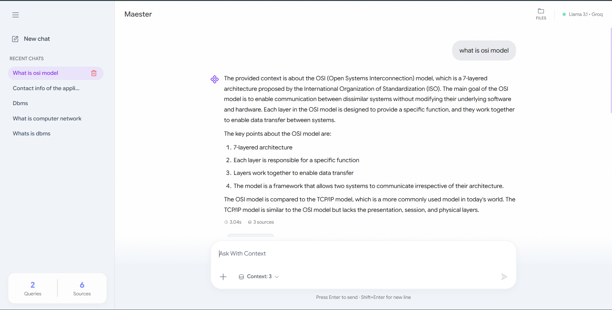
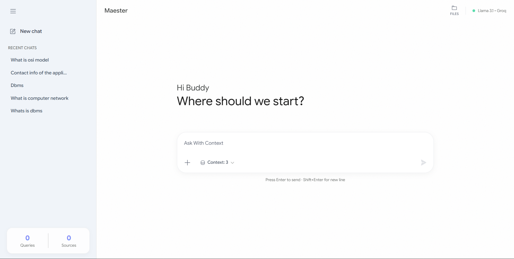
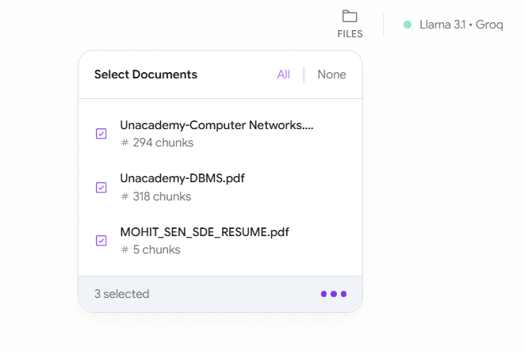
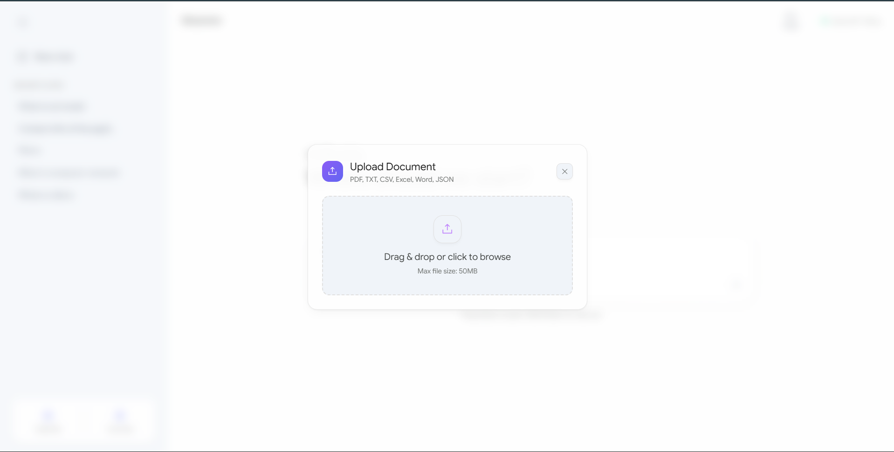

# Maester RAG 🧠

A full-stack, production-ready **Retrieval-Augmented Generation (RAG)** application. Chat with your technical documents, academic papers, and notes using local semantic search and cloud LLMs via a premium, clean light-mode UI.






## 🛠️ How it works (Process)

1. **Upload Documents**: Click the `+` icon in the chat input to upload PDFs, TXT, CSV, or JSON files.
2. **Local Indexing**: The system automatically chunks the text and generates local embeddings using `all-MiniLM-L6-v2`.
3. **Select Context**: Use the file selector in the header to pick specific documents you want the AI to "read".
4. **Tune Retrieval**: Adjust the "Context Chunks" (Top-K) to control how many snippets the AI retrieves for every query.
5. **Chat**: Ask questions! The AI will answer based ONLY on your uploaded documents, providing citations for transparency.

## ✨ Architecture & Data Flow

```text
[ Document ] → Chunking (LangChain) → Local Embeddings (SentenceTransformers) → FAISS Index
                                                                                     ↓
[ Answer ] ← Groq API (Llama 3.1) ← Augmented Prompt ← User Query + Context Chunks ←-'
```

### Key Technical Decisions
- **Local Embeddings**: `all-MiniLM-L6-v2` runs locally to eliminate embedding API costs and ensure data privacy during indexing.
- **FAISS Vector DB**: Chosen for ultra-fast, in-memory L2 distance calculations. Indexes are persisted locally to disk (`/faiss_store`).
- **Modern UI**: A pristine light-themed React interface inspired by premium AI apps, featuring session history, dynamic contexts, and smooth animations.

## 🚀 Run Locally

### 1. Backend (FastAPI)
```bash
# Install dependencies (uv recommended)
uv sync   # or: pip install -r requirements.txt

# Set your Groq API Key
echo "GROQ_API_KEY=your_key_here" > .env

# Start the server (runs on http://localhost:8000)
python -m uvicorn backend.main:app --reload
```

### 2. Frontend (React/Vite)
```bash
cd frontend
npm install

# Start the dev server (runs on http://localhost:3000)
npm run dev
```

## 📂 Repository Structure

- `frontend/` - React/Vite UI, Tailwind CSS, built with Phosphor Icons.
- `backend/`
  - `main.py` - FastAPI application entry point.
  - `routers/` - API route definitions for chat, document uploads, and sessions.
  - `src/` - Core RAG Logic (`data_loader`, `embedding`, `vectorstore`, `search`).
  - `data/` & `faiss_store/` - Storage for uploaded files and persistent FAISS indexing.
