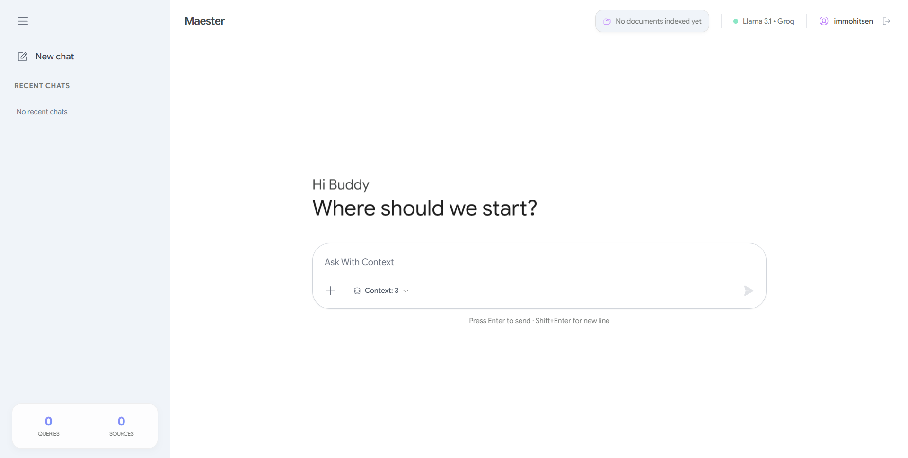

# Maester — RAG Chat Application

A document-based AI assistant. Upload your files, ask questions, get answers grounded in your documents.



## Features

- **Document Q&A** — Upload PDFs, Word, Excel, TXT, CSV, JSON and chat with them
- **User Accounts** — Register/login with username & password; each user's data is fully isolated
- **Chat History** — Conversations saved and resumable across sessions
- **Conversation Memory** — Summary buffer: LLM retains context from earlier in the conversation
- **File Selection** — Choose which uploaded files to use as context per query
- **File Download** — Download originally uploaded files directly from S3
- **Source Citations** — Every answer shows which document chunks were used with confidence scores
- **Intent Detection** — Chitchat handled directly; document queries go through RAG pipeline

## Tech Stack

| Layer | Tech |
|-------|------|
| Frontend | React + Vite + Tailwind |
| Backend | FastAPI + Python |
| Vector DB | MongoDB Atlas Vector Search |
| Embeddings | `all-MiniLM-L6-v2` (sentence-transformers) |
| LLM | Llama 3.1 via Groq |
| Storage | AWS S3 |
| Deployment | AWS Lambda (Docker) + Vercel |
| Auth | JWT (15-day tokens) + bcrypt |

## Local Setup

**Backend**
```bash
cd backend
pip install -r requirements.txt
python main.py
```

**Frontend**
```bash
cd frontend
npm install
npm run dev
```

Set `VITE_API_URL=http://127.0.0.1:8000/api` in `frontend/.env`.

## Environment Variables

```
GROQ_API_KEY=
MONGODB_URI=
JWT_SECRET=
AWS_REGION=ap-south-1
S3_BUCKET=
```

## Deploy

```powershell
cd backend
.\deploy-lambda.ps1
```
